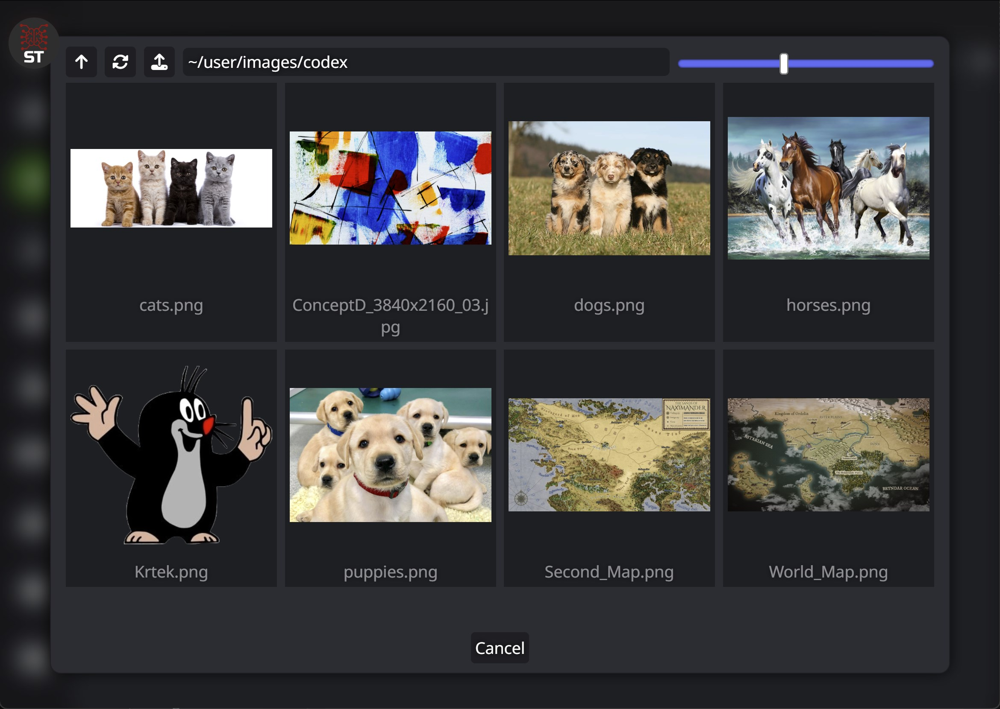

# SillyTavern File Explorer

File Explorer to browse and pick files from SillyTavern directories.




## Use in STscript

```stscript
/explorer types=["image","text"] ext=["png","jpg","txt"] ~/user/images
```


## Use in Javascript

For example in a SillyTavern extension.

```javascript
import { FileExplorer } from '../SillyTavern-FileExplorer/src/FileExplorer.js';

const fe = new FileExplorer('~/user/images');
fe.typeList = ['image', 'text'];
fe.extensionList = ['png', 'jpg', 'txt'];
await fe.show();
console.log(fe.selection);
```


## Requirements
- [SillyTavern Files Plugin](https://github.com/LenAnderson/SillyTavern-Files)
